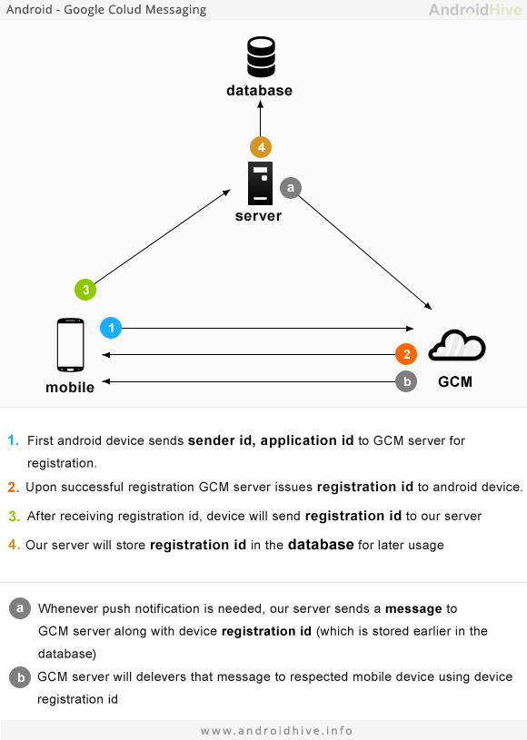

# GCM Demo application

GCM is [Google Cloud Messaging for Android](https://developers.google.com/cloud-messaging/).

This demo application is created with Ionic framework.

For GCM Push Messaging I have chosen [AirBop](http://www.airbop.com/) service because it has a free plan.

The following image explains how GCM works (source: androidhive).



## Preparation

You need node.js and git preinstalled.

Install [Ionic](http://ionicframework.com/), [Cordova](https://cordova.apache.org/) and [Bower](http://bower.io/):

```
npm install -g ionic cordova bower
```

Install Android environment (JDK, SDK) by following [these instructions](http://cordova.apache.org/docs/en/edge/guide_platforms_android_index.md.html) on Cordova docs.

## Register at Google

Creating a Google API project

- Open the [Google Developers Console](https://console.developers.google.com/).
- If you haven't created an API project yet, click Create Project.
- Supply a project name and click Create.
- Once the project has been created, a page appears that displays your project ID and project number.
- Copy down your project number. You will use it later on as the GCM sender ID.

To enable the GCM service:

- In the sidebar on the left, select APIs & auth.
- In the displayed list of APIs, turn the Google Cloud Messaging for Android toggle to ON.

To obtain an API key:

- In the sidebar on the left, select APIs & auth > Credentials.
- Under Public API access, click Create new key.
- In the Create a new key dialog, click Server key.
- In the resulting configuration dialog, supply your server's IP address. For testing purposes, you can use 0.0.0.0/0.
- Click Create.
- In the refreshed page, copy the API key. You will need the API key later on to perform authentication in your app server.


## Register at AirBop

Register at [airbop.com](http://www.airbop.com/) with your email address.

Free Plan: Unlimited Push Notifications, 1,000 devices for free

Go to Dashboard, go to Add New App. Fill the form:

- App Name ( <code>gcmdemo</code> )
- Java Package Name ( <code>gcmdemo.pbakondy.com</code> )
- Google API Key ( copy from the Google registration )

After a successful submit copy AIRBOP_APP_KEY and APP_SECRET values.

## Create Ionic project

Run this command (you can replace appname and id but you have to use the same at AirBop registration)

```
ionic start --appname gcmdemo --id com.pbakondy.gcmdemo gcmdemo blank

cd gcmdemo
```

Add [Push Notification handler](https://github.com/phonegap-build/PushPlugin) Cordova plugin

```
ionic plugin add com.clone.phonegap.plugins.pushplugin
```

Add [ngCordova](http://ngcordova.com/) and [cordova-airbop-client](https://github.com/pbakondy/cordova-airbop-client) JS libraries:

```
bower install ngCordova cordova-airbop-client
```

Copy/overwrite the files from this repository into your project:
- <code>www/index.html</code>
- <code>www/js/app.js</code>
- <code>www/js/gcm.js</code>

Open <code>gcm.js</code> in editor and set the constant values.

Finally add Android platform and build the project.

```
ionic platform add android
ionic build android
```

You can build and run directly on your connected phone with this command:

```
ionic run android
```

## Running the app

You will see a button with label "Register App". Tap on it. It will send a registration request to Google, and with the return "registration id" value it will register to AirBop server.

You should see your device on AirBop administration interface as a registered device. Now you can send push notification to your phone.


## License

gcm-demo-app is licensed under the MIT Open Source license. For more information, see the LICENSE file in this repository.
